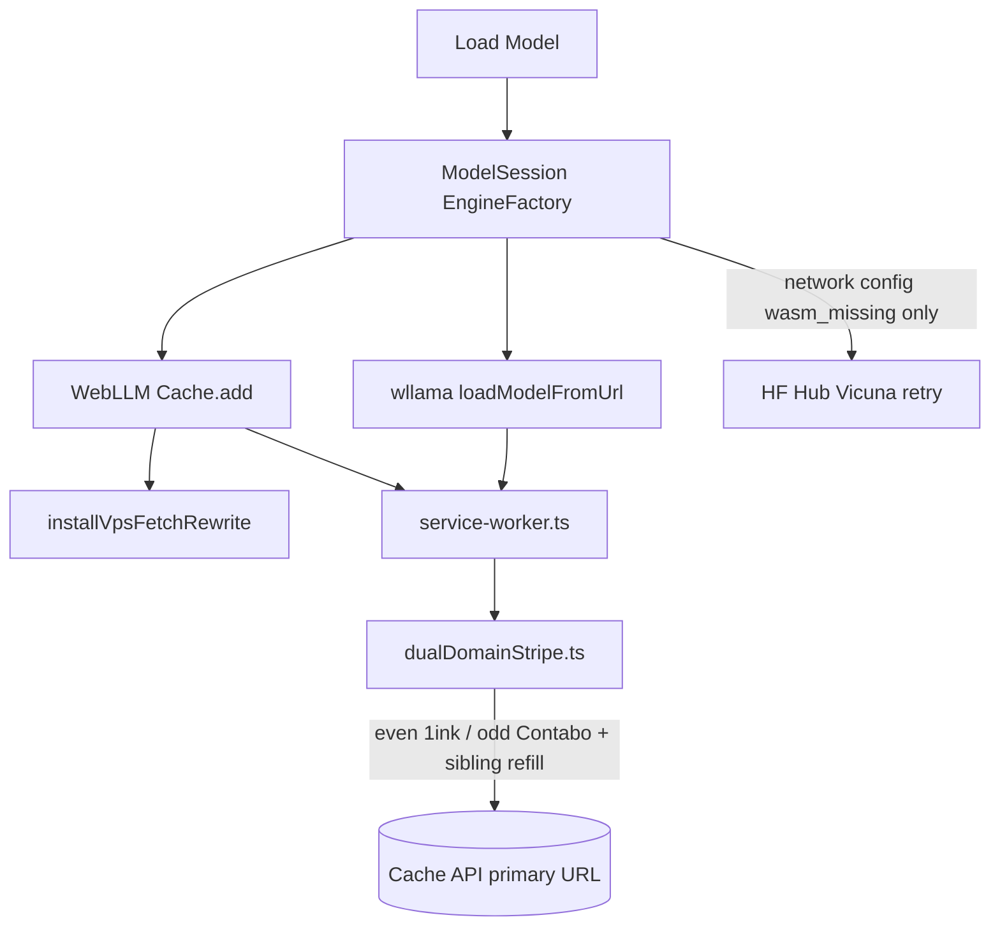

# Parallel Model Downloads

## Overview

Large model shards (`.bin` / `.safetensors` / `.gguf` / `.wasm` over 42MB) are
downloaded with **HTTP Range** requests. On our VPS hosts they are also
**striped across two origins** so a stall or outage on one host does not fail
the whole Vicuna 7B load.

| Origin | Role |
|--------|------|
| `storage.1ink.us` | Canonical primary (Cache API keys, app URLs) |
| `storage.noahcohn.com` | Contabo mirror — alternating chunks + refill |

### Choice: Option A (SW-only intercept)

The service worker is the **sole** parallel download path. GGUF loads use the
same intercept (`.gguf`). A second in-page Range assembler
(`ParallelDownloadManager`) was removed in [#306](https://github.com/ford442/the_jokesters/issues/306)
because it had no production caller and feeding Cache from it would fork
WebLLM's cache keys.

| Option | Decision |
|--------|----------|
| **A. SW-only striping** | **Chosen.** WebLLM `Cache.add` and wllama URL fetches are intercepted by `src/service-worker.ts`. |
| B. PDM striping + feed Cache | Rejected: duplicate cache keys vs WebLLM. |
| C. Hybrid two policies | Rejected: one planner, one assembler. |

Chunk size / concurrency live in `src/utils/dualDomainStripe.ts` and are imported by the SW.

## Architecture



### Shared planner (unit-tested)

**File:** `src/utils/dualDomainStripe.ts`

Pure functions: `buildStripePlan`, `preferredOriginForChunk`, `fetchStripedChunk`, `stripeCacheKey`. Tests in `tests/unit/dualDomainStripe.test.ts` (no service worker).

### Service Worker (production path)

**File:** `src/service-worker.ts`

```
Browser / WebLLM Cache.add("https://storage.1ink.us/.../params_shard_0.bin")
    ↓
Service Worker intercepts (rewrites /resolve/main/ if needed)
    ↓
HEAD on primary (mirror HEAD only for size if primary metadata fails)
    ↓
File > 42MB + Accept-Ranges?
    ↓ yes
Split → 4 workers → even/odd hosts → sibling refill on miss
    ↓
Assemble → Response (CORS headers) for the *original* URL
    ↓
WebLLM Cache.put under the canonical primary key
```

HEAD used to pin every subsequent GET to `headResponse.url` (whichever host answered). That is gone — the download URL stays canonical so striping can use both origins.

`skipWaiting` + `clients.claim()` run on install/activate so the worker can rewrite on the first load. The page also installs `installVpsFetchRewrite` / `installVpsCacheRewrite` before the SW is guaranteed to control the client.

## Dual-domain striping

1. Split the file into **42MB** chunks.
2. **Even** chunks prefer primary; **odd** chunks prefer the mirror.
3. A miss, 4xx/5xx, timeout (45s), or wrong byte length on the preferred origin is a **soft failure** — the same range is retried on the sibling host.
4. Chunks are concatenated in index order and returned as one `Response` for the **original request URL**.
5. The service worker **never** `Cache.put`s under the mirror host. WebLLM / `installVpsCacheRewrite` still keys Cache API entries on the canonical primary URL (`/resolve/main/` form included). No duplicate cache entries for the same logical shard.

**Retry mirror** (error panel) sets a one-load session flag that inverts even/odd preference (`invertOrigins`) via `SET_STRIPE_CONFIG`. Cache keys stay on the primary host.

Optional **TTFB race** (first-byte / headers-received, abort the loser): off by default. Enable with `VITE_VPS_STRIPE_RACE=1` or `?stripeRace`. Worker count is halved so in-flight connections stay around four.

Same-origin `.gz` twins are **not** striped (Contabo-only gzip is ignored by design). Small JSON/config files still use `fetchWithRetry` with whole-file mirror failover.

### Kill-switch (mirror diverged)

| Mechanism | How |
|-----------|-----|
| Build | `VITE_VPS_DUAL_DOMAIN_STRIPE=0` |
| Query | `?noStripe` or `?stripeOff` |
| localStorage | `jokesters-dual-domain-stripe=0` then reload |

The page posts `SET_STRIPE_CONFIG` to the service worker from `bootstrap.ts` so a runtime flag takes effect without a rebuild. Whole-file `fetchWithRetry` failover remains even when striping is off.

### Progress / ETA

The SW still returns a fully assembled body, so WebLLM's `InitProgressReport` stays file-level. `bootstrap.ts` prefixes that text with a stable phase (`rewrite` → `wasm_probe` → `download` → `compile` → `ready`) via `classifyInitProgress`. Stripe retries are **not** extra progress events.

`stripeProgress()` counts **successfully assembled** chunk bytes only — a refill does not double-count.

---

## Testing

```bash
npm test            # includes tests/unit/dualDomainStripe.test.ts
npm run typecheck
```

### Simulate a degraded origin (acceptance)

1. DevTools → Network → Block request URL → `storage.1ink.us` **or** `storage.noahcohn.com`.
2. Cold-load Vicuna 7B MLC (clear Cache Storage / IndexedDB model cache first).
3. Console should show stripe refill warnings for chunks that preferred the blocked host; the shard should still complete.
4. Application → Cache Storage: keys for the shard should be the **primary** URL only (no `storage.noahcohn.com` duplicates).
5. Repeat with `?noStripe` — downloads stay on one host (failover only after full-file retries).

### Monitor

- Network: `206 Partial Content` Range GETs alternating hosts (`bytes=0-…`, `bytes=44040191-…`).
- Console: `[ServiceWorker] Parallel download (dual-domain stripe)` and refill lines.
- Application → Service Workers: Update on reload after a SW change (`skipWaiting` + `clients.claim` are already on).

---

## Implementation details

| Constant | Value |
|----------|--------|
| Chunk size | 42MB |
| Parallel workers | 4 (2 if TTFB race is on) |
| Chunk timeout | 45s (then sibling refill) |
| TTFB race budget | 8s per origin (optional) |

### Cache keys

| Layer | Key |
|-------|-----|
| WebLLM Cache API | Original request URL (typically primary + `/resolve/main/`) |
| SW stripe plan `cacheKey` | Primary-host equivalent of the fetch URL |
| Mirror Range GETs | Ephemeral; not stored |

### Fallback

```
No Accept-Ranges or file ≤ 42MB
    → fetchWithRetry (primary, then whole-file mirror)
Stripe preferred origin fails
    → same range on sibling origin
Both origins fail for a chunk
    → download fails (last-ditch whole-file fetch in the SW catch)
```

---

## Setup & build

Vite `injectManifest` compiles `src/service-worker.ts` → `service-worker.js`.
Registration is `registerSW()` from `virtual:pwa-register` in `src/app/bootstrap.ts`
(not a hand-rolled `navigator.serviceWorker.register` in `main.ts`).

```bash
npm run build
# dist/service-worker.js  (stable name)
```

---

## Troubleshooting

### Mirror diverged (wrong bytes, same size)

Striping cannot checksum shards. Disable it (`?noStripe` or `VITE_VPS_DUAL_DOMAIN_STRIPE=0`) and resync Contabo → DreamHost (`contabo_storage_manager` sync scripts).

### Service worker still on old code

Hard refresh, or DevTools → Application → Service Workers → Update. `skipWaiting` / `clients.claim` apply on the next navigation after install.

### Downloads still slow / one host only

- Kill-switch on (`?noStripe`)
- File smaller than 42MB
- Server omitted `Accept-Ranges`
- HuggingFace / non-VPS URL (no stripe pair)

---

## Related

- Issue [#302](https://github.com/ford442/the_jokesters/issues/302) — dual-domain striping
- [#306](https://github.com/ford442/the_jokesters/issues/306) — unify download stack + load diagnostics (this doc)
- [#304](https://github.com/ford442/the_jokesters/issues/304) — HF Vicuna weight failover
- [#216](https://github.com/ford442/the_jokesters/issues/216) — custom Vicuna wasm / VRAM (orthogonal)
- `src/utils/vpsStorageUrl.ts` — host allowlist, `toVpsMirrorUrl`
- `docs/MODEL_HOSTING.md`
